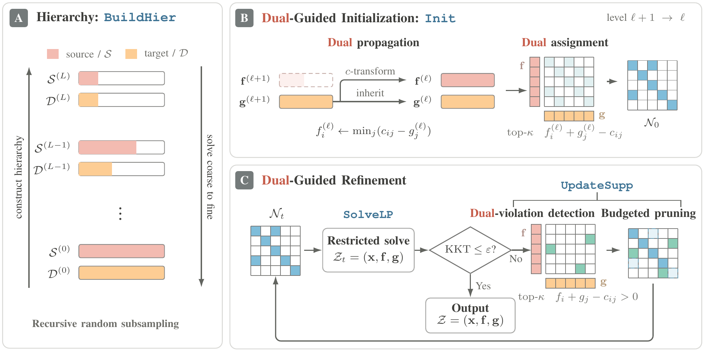
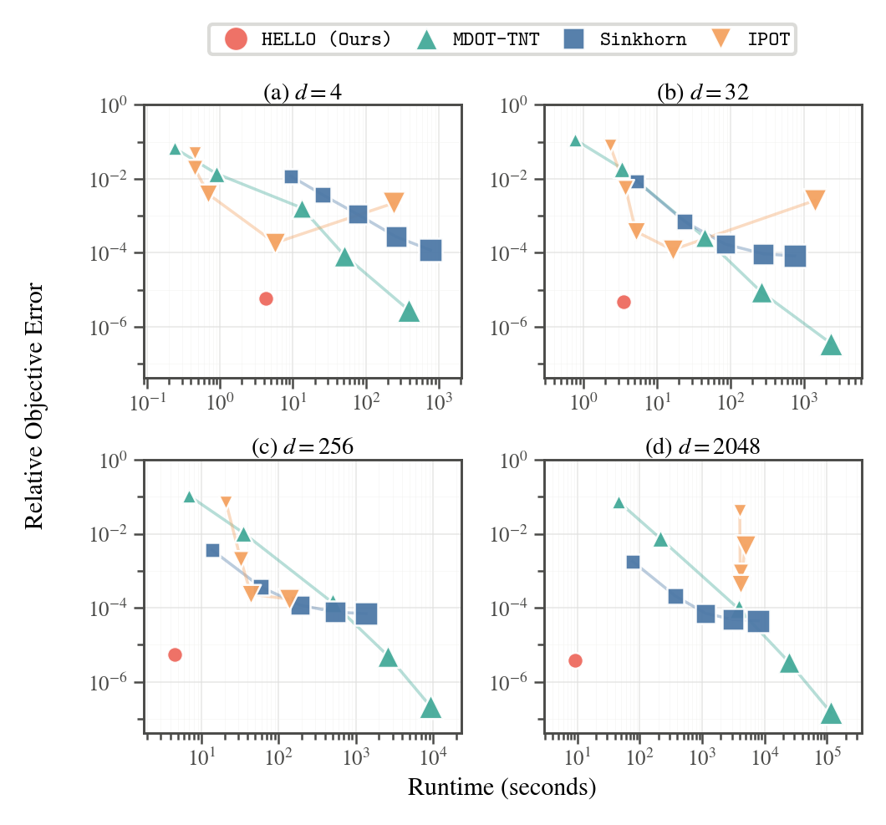

# HELLO

HELLO is a high-performance solver for large-scale, unregularized discrete optimal transport (OT) between point clouds. By combining a dual-guided hierarchy with efficient GPU parallelization, it computes exact sparse transport plans with low memory, fast runtime, and high accuracy. On a single A100 or H100 GPU, HELLO solves instances with millions of points across thousands of feature dimensions.

### Why Choose HELLO?
- **High-Accuracy Sparse Solutions**: Solves unregularized discrete OT to a prescribed full-space relative KKT tolerance (alongside corresponding dual potentials);
- **Million-Scale on a Single GPU**: Memory complexity scales as $\mathcal{O}(m+n)$—"store points, solve transport." A single GPU solves $m=n=1.28\times10^6, d=8192$ using only $41.6\text{ GiB}$ peak GPU memory;
- **Efficiency Across Dimensions**: Maintains high convergence efficiency across feature dimensions from single digits to thousands;
- **General Pairwise Costs**: Supports not only $\ell_2^2$ (squared Euclidean), but also $\ell_1$, $\ell_2$, $\ell_\infty$, and general pairwise cost functions;
- **Backend Design**: Provides a pure PyTorch backend (out-of-the-box, cross-platform) alongside a native CUDA backend (extreme performance);
- **Beyond Standard OT**: Out-of-the-box support for semi-discrete OT, Gromov–Wasserstein (GW), and unbalanced OT (UOT).

<table style="width: 100%;">
  <tr>
    <td width="60%" align="center">
      
    </td>
    <td width="40%" align="center">
      
    </td>
  </tr>
</table>

## Quickstart

`examples/quickstart.py` can be executed directly on a synthetic Brenier mapping problem ($n=m=2048, d=32$):

```python
import numpy as np
import hello_ot

# 1. Construct test problem with known analytical ground truth
rng = np.random.default_rng(42)
source = rng.normal(size=(2048, 32)).astype(np.float32)
target = source + 2.0 * np.tanh(source)
target = target[rng.permutation(len(target))]

# 2. Solve OT problem (defaults to uniform marginals and squared Euclidean distance)
result = hello_ot.solve(
    source,
    target,
    options=hello_ot.SolverOptions(backend="torch", torch_device="auto"),
)

# 3. Inspect results
print(f"Optimal objective: {result.objective:.6f}")
print(f"Nonzero transport entries: {result.solution.values.size}")

# Sparse transport matrix (scipy.sparse.coo_matrix) and dual potentials (f, g)
x = result.solution.to_sparse_matrix()
f, g = result.solution.source_dual, result.solution.target_dual
```

Array inputs use uniform marginals and squared Euclidean cost by default. Non-uniform masses can be specified via `source_mass` and `target_mass`, and alternative ground costs selected via `cost="l1"`, `"l2"`, or `"linf"`.

Advanced options are configured through `hello_ot.SolverOptions` (e.g., `backend="native"`, `backend="torch"`).

> **Tip**: A complete verification script is bundled in the repository:
> ```bash
> python3 examples/quickstart.py
> ```
> The script solves the problem end-to-end and verifies primal feasibility, dual feasibility, and objective error against the analytical Brenier ground truth.

## Installation Guide

### 1. PyTorch: Out of the Box (`backend="torch"`)

If PyTorch is already installed, install HELLO-OT directly:

```bash
python3 -m pip install .
```

If PyTorch is not installed, or if you plan to test the native backend or run
the paper reproduction, create the recommended `hello_ot` environment:

```bash
bash scripts/create_hello_ot_env.sh hello_ot
```

The script installs Python 3.12, PyTorch 2.7.1 with the CUDA 11.8 runtime,
NumPy 1.26.4, SciPy 1.15.3, and the portable HELLO-OT package. It prefers
Conda and falls back to Micromamba. Replace the final argument with another
name, such as `hello_ot_test`, to create a separate environment.

---

### 2. CUDA: Extreme Performance (`backend="native"`)

Includes resident-streamed CUDA scan kernels and a CUDA-native LP solver:
- **Supported Architectures**: NVIDIA GPUs with compute capabilities `sm_80`, `sm_86`, `sm_89`, `sm_90` (A100, RTX 3080 Ti/3090, RTX 4060 Ti/4090, H100, etc.);
- **Target Environment**: Linux x86-64 (glibc ≥ 2.29), Python 3.12, PyTorch 2.7.1+cu118.

#### Option A: Install Prebuilt Wheel (Recommended, No Local Compilation)

After creating the environment above, install and verify the native wheel:

```bash
bash scripts/install_native.sh hello_ot
```

This replaces the portable distribution with the matching native wheel while
retaining both `backend="torch"` and `backend="native"`.

#### Option B: Build from Source

For development, use Python 3.12, PyTorch 2.7.1+cu118, CUDA 11.8 NVCC and
CCCL headers, a compatible C++ compiler, Ninja, and pybind11:

```bash
conda install -c nvidia cuda-nvcc=11.8 cuda-cccl=11.8.89
python3 -m pip install '.[native-build]'
scripts/build_native_wheel.sh dist
python3 -m pip install dist/*.whl
```

### 3. GPU JAX and Paper Reproduction

Public reproduction scripts for the core paper experiments (large-scale scaling, Pareto curves, exactness verification, and parameter sensitivity) are organized under [`export_experiments/`](export_experiments/).

Add GPU JAX, OTT-JAX, and the remaining reproduction dependencies to the same
environment:

```bash
bash scripts/install_jax_gpu.sh hello_ot
conda activate hello_ot
```

The installer keeps PyTorch on cuDNN 9 and places the CUDA 11 JAX requirement
on cuDNN 8 in an isolated sidecar. The environment activation hook selects the
correct CUDA 11.8 tools and libraries automatically. Micromamba environments
use `micromamba activate hello_ot` instead.

For detailed execution instructions, please refer to [export_experiments/README.md](export_experiments/README.md).
